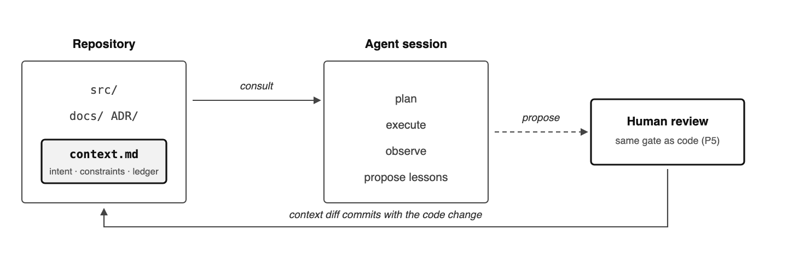
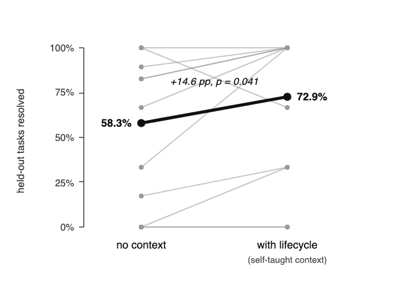
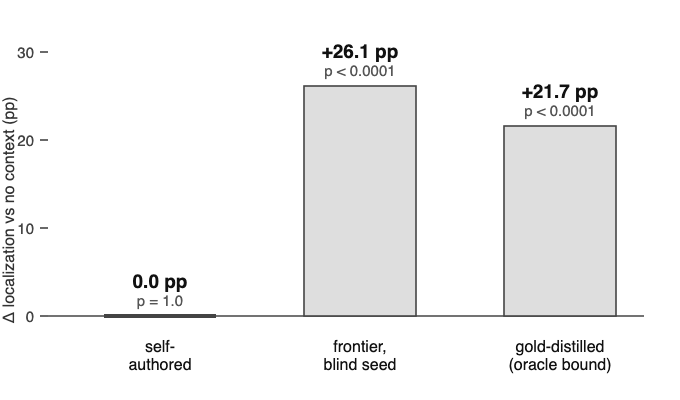
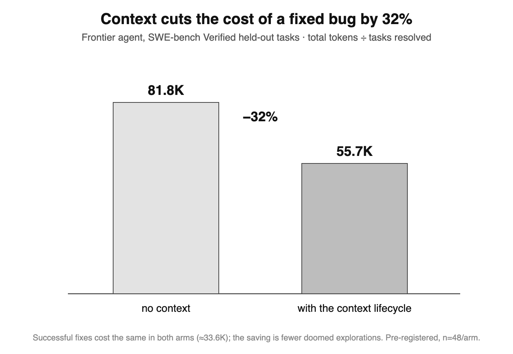

# context.md

A proposed standard for AI project context: one markdown file, versioned with the code, that agents read before planning and append to after working — under human review.

> Git stores what changed. `context.md` stores what the project knows.

📋 [Spec](SPEC.md) · 📝 [Full example](context.md.example) · 📄 [Whitepaper (PDF)](whitepaper/context-md-manifesto.pdf) · 🎓 [Paper (preprint, PDF)](whitepaper/repository-context-layer-paper.pdf)

<p align="center">
  
</p>

## Does it work? Measured.

A pre-registered evaluation on SWE-bench Verified (protocol frozen and timestamped before any run — see [`experiment/`](experiment/)):

<table>
<tr>
<td width="50%" align="center">
  <br/>
  <sub>A frontier agent running the lifecycle resolves <b>72.9%</b> of held-out tasks vs <b>58.3%</b> without it (+14.6&nbsp;pp, p&nbsp;=&nbsp;0.041).</sub>
</td>
<td width="50%" align="center">
  <br/>
  <sub>Context helps a small model only when its <b>author</b> is more capable: frontier-written context +26.1&nbsp;pp (p&nbsp;&lt;&nbsp;0.0001); the model's own lessons +0.0.</sub>
</td>
</tr>
</table>

<p align="center">
  
</p>

And it pays for itself: **32% fewer tokens per fixed bug** — successful fixes cost the same; the saving is the doomed exploration that never happens.

Every number is reproducible from the released data: `cd experiment && make docker-reproduce` → `15/15 claims reproduced`. Full protocol, transcripts, and verdicts in [`experiment/`](experiment/); details in the [paper](whitepaper/repository-context-layer-paper.pdf).

## The file

```markdown
# Repository Context

## Intent
Local-first CLI. Files are the source of
truth; SQLite is a rebuildable index.

## Constraints
- No ORM. Rejected 2026-03: query opacity
  broke the offline repair path.

## Evolved Context
- [2026-06-29] pkg x >= 3.0 breaks ARM64
  builds. Pin to 2.3.x until fixed.
```

Three sections, all required:

- **Intent** — what the project is, and the design philosophy everything else must serve.
- **Constraints** — the non-negotiable rules, each with its reason. Record the rejection, not just the rule; a rule without a reason is one the agent can comply with but never generalize from.
- **Evolved Context** — an append-only, dated ledger of what agents and humans learned while working here. Entries that prove out get promoted into Constraints by an ordinary reviewed edit.

Agents find the file at a fixed path — `.repo/context.md`, else `context.md` at the repository root — never by searching.

## The contract

```
consult → execute → update → commit
```

1. **Consult.** Read the context before planning.
2. **Execute.** Constraints are binding; Intent breaks ties on open design choices.
3. **Update.** Append what the work taught: the package that breaks the ARM64 build, the proxy timeout nothing documents.
4. **Commit.** Code and updated context travel in one reviewed change, so a human approves both together.

Because the file lives in git, it branches when the code branches, merges when it merges, and rolls back when it rolls back. Conflicting learnings on two branches are an ordinary merge conflict, resolved by a human in review.

## Adopting it today

1. Create `context.md` at your repository root (start from [the example](context.md.example)).
2. Tell your agent to read it before planning and append to **Evolved Context** before committing.
3. Review context diffs like code diffs. Promote proven ledger entries into **Constraints**.

No SDK, no server, no vendor: any agent that can read a file participates, and any human with a text editor is a first-class writer.

## Why not existing artifacts

READMEs describe how to use a project, not how to change it. ADRs are write-once essays no agent is required to read. RAG retrieves by similarity, which fails for constraints — a rule matters most when nothing in the prompt resembles it. IDE memories are private to one tool and invisible to review. Agent instruction files (CLAUDE.md, AGENTS.md) carry orders downward but have no defined way to absorb what the agent learns. What's missing is the combination: versioned with the code, consulted by contract, and written back by the agent under human review. The full argument is in the [whitepaper](whitepaper/context-md-manifesto.pdf); the formal treatment — properties, lifecycle semantics, design analysis, and the reference implementation — is in the [paper](whitepaper/repository-context-layer-paper.pdf).

## Scope

The standard covers discovery and lifecycle, not content. Anything beyond the three headers — decision logs, pattern catalogs, per-directory context — is convention layered on top. Under-specified and adopted beats complete and ignored.

[Metatron](https://github.com/kerbelp/metatron) is one reference implementation: decisions kept as git-backed markdown, served to agents at consult time, feedback routed into the ledger. The abstraction is the point, though — any tool, or none at all, can implement it.

---

*© 2026 P. Kerbel. Freely available. This repository is the canonical home of the Repository Context Layer.*
